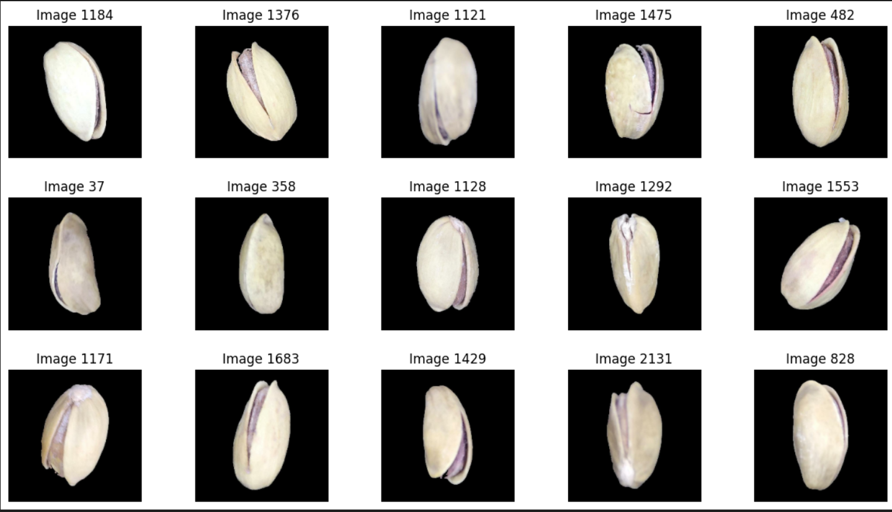

AML Final Project: Feature + Image Classification using PCA & CNNs

This project showcases a comprehensive machine learning pipeline for both **structured tabular data** and **unstructured image data**, as part of the **Applied Machine Learning (AML)** course final assignment.

---

## Project Overview

The notebook includes:

- **Exploratory Data Analysis** on a feature-based Pistachio dataset
- **Dimensionality Reduction** using PCA
- **CNN-based Image Classification** using both:
  - Custom CNN architectures (CNN1, CNN2, CNN3)
  - Pretrained CNN models for feature extraction
- Model comparison and performance evaluation

---

## Technologies Used

- Python 3.10+
- NumPy, Pandas, Matplotlib, Seaborn
- Scikit-learn
- TensorFlow / Keras
- Google Colab (recommended)

---

## Key Sections in the Notebook

| Section | Description |
|--------|-------------|
| Data Loading | Downloads, saves, and reads datasets |
| Feature Dataset | Correlation, Subset selection, PCA |
| Image Dataset | Preprocessing, Exploration |
| CNN Models | Three CNN architectures + Transfer Learning |
| Model Evaluation | Accuracy, comparison, analysis |

